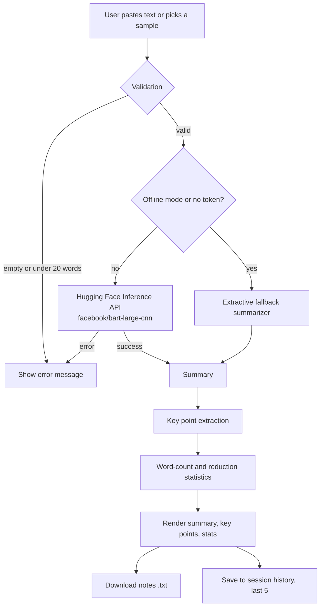

<div align="center">

# 📚 Smart Study Notes Generator

### Summarize any text, instantly.

An AI-powered study assistant that turns long paragraphs into concise summaries, key study points, and compression statistics, powered by **Hugging Face BART** and wrapped in a modern glassmorphism **Streamlit** interface.


</div>

---

## 📑 Table of Contents

- [Overview](#-overview)
- [Key Features](#-key-features)
- [Demo & Screenshots](#-demo--screenshots)
- [How It Works](#-how-it-works)
- [Tech Stack](#-tech-stack)
- [Project Structure](#-project-structure)
- [Getting Started](#-getting-started)
- [Configuration](#-configuration)
- [Usage Guide](#-usage-guide)
- [Algorithms in Detail](#-algorithms-in-detail)
- [Error Handling](#-error-handling)
- [UI & Design System](#-ui--design-system)
- [Troubleshooting](#-troubleshooting)
- [Roadmap](#-roadmap)
- [Contributing](#-contributing)
- [License](#-license)
- [Author](#-author)

---

## 🔎 Overview

**Smart Study Notes Generator** helps students and self-learners compress long study material into something they can revise quickly. Paste a paragraph and the app returns:

1. An **abstractive AI summary** generated by `facebook/bart-large-cnn`.
2. **Key study points** extracted from the original text.
3. **Word-count statistics** showing exactly how much the text was reduced.
4. A **downloadable `.txt` notes file** for offline revision.

The app also ships with an **offline extractive fallback**, so it keeps working with no API token and no internet connection to the model.

---

## ✨ Key Features

| Feature | Description |
|---|---|
| 🤖 **AI Summarization** | Abstractive summaries from `facebook/bart-large-cnn` via the Hugging Face Inference API |
| 📌 **Key Points Extraction** | Top 5 sentences ranked by overlap with the generated summary |
| 📊 **Compression Statistics** | Original words, summary words, and reduction percentage |
| 🔌 **Offline Mode** | Frequency-based extractive summarizer that needs no API token |
| ⚡ **Sample Texts** | One-click samples: Climate Change, Artificial Intelligence, DNA & Genetics |
| 🕘 **Session History** | The last 5 summaries are kept for the current session |
| ⬇️ **Export Notes** | Download a formatted `study_notes.txt` with summary, key points, and stats |
| 🛡️ **Robust Error Handling** | Clear messages for cold starts (503), invalid tokens (401), timeouts, and short input |
| 🎨 **Modern UI** | Dark glassmorphism theme with animated gradient orbs, custom typography, and responsive layout |

---

## 🖼️ Demo & Screenshots

> Add your screenshots to an `assets/` folder and update the paths below.

| Home | Generated Output |
|---|---|
|  |  |

---

## ⚙️ How It Works



---

## 🧰 Tech Stack

| Layer | Technology |
|---|---|
| Language | Python 3.9+ |
| Frontend / App framework | [Streamlit](https://streamlit.io/) |
| NLP model | [`facebook/bart-large-cnn`](https://huggingface.co/facebook/bart-large-cnn) |
| Model hosting | Hugging Face Inference API |
| HTTP client | `requests` |
| Config management | `python-dotenv` |
| Styling | Custom CSS (glassmorphism), Plus Jakarta Sans and JetBrains Mono fonts |

---

## 🗂️ Project Structure

```text
smart-study-notes-generator/
├── app.py              # Main Streamlit application (UI, logic, helpers)
├── requirements.txt    # Python dependencies
├── .env                # Local secrets (HF_TOKEN), not committed
├── .gitignore
├── assets/             # Screenshots used in this README
└── README.md
```

---

## 🚀 Getting Started

### Prerequisites

- Python **3.9** or newer
- `pip`
- A free [Hugging Face account and access token](https://huggingface.co/settings/tokens) (optional, since offline mode works without one)

### 1. Clone the repository

```bash
git clone https://github.com/<your-username>/smart-study-notes-generator.git
cd smart-study-notes-generator
```

### 2. Create a virtual environment (recommended)

```bash
python -m venv venv

# macOS / Linux
source venv/bin/activate

# Windows
venv\Scripts\activate
```

### 3. Install dependencies

Create a `requirements.txt` with:

```text
streamlit
requests
python-dotenv
```

Then install:

```bash
pip install -r requirements.txt
```

### 4. Add your Hugging Face token

Create a `.env` file in the project root:

```env
HF_TOKEN=your_huggingface_token_here
```

### 5. Run the app

```bash
streamlit run app.py
```

The app opens at **http://localhost:8501**.

---

## 🔧 Configuration

| Setting | Where | Description |
|---|---|---|
| `HF_TOKEN` | `.env` file | Hugging Face API token, loaded automatically on startup |
| **HF API Token** field | Sidebar | Override the token at runtime without editing files |
| **Offline mode** checkbox | Sidebar | Forces the extractive fallback and skips the API entirely |

**Model parameters** (in `call_hf_api`):

| Parameter | Value | Purpose |
|---|---|---|
| `max_length` | `130` | Upper bound on summary length in tokens |
| `min_length` | `30` | Lower bound on summary length in tokens |
| `do_sample` | `False` | Deterministic output, so the same input gives the same summary |
| `truncation` | `only_first` | Safely trims inputs that exceed the model's context window |

> ⚠️ Never commit your `.env` file. Add it to `.gitignore`:
>
> ```gitignore
> .env
> venv/
> __pycache__/
> ```

---

## 📖 Usage Guide

1. **Open the sidebar** (top-left arrow) and paste your Hugging Face token, or tick **Offline mode**.
2. **Provide text**: type or paste a paragraph (minimum **20 words**), or click a sample chip (🌍 Climate, 🤖 AI / ML, 🧬 Genetics).
3. Click **✨ Generate Summary & Notes**.
4. Review the **Summary**, **Key Points**, and **Word Count Statistics** in the right-hand panel.
5. Click **⬇ Download Notes (.txt)** to save your study notes.
6. Scroll down to **Recent Summaries** to revisit earlier results from the current session.
7. Use **Clear** to reset the input and output.

### Sample exported notes

```text
SMART STUDY NOTES
========================================

SUMMARY
----------------------------------------
<AI generated summary>

KEY POINTS
----------------------------------------
  1. <key point>
  2. <key point>
  ...

STATISTICS
----------------------------------------
Original Word Count : 112
Summary Word Count  : 46
Reduction           : 58.9%
Formula             : ((Original - Summary) / Original) x 100

Model: facebook/bart-large-cnn · Hugging Face Inference API
```

---

## 🧠 Algorithms in Detail

### 1. Abstractive summarization (online mode)

The input text is sent to `facebook/bart-large-cnn`, a sequence-to-sequence transformer fine-tuned on the CNN/DailyMail dataset. Unlike extractive methods, BART *generates* new sentences, which produces a more fluent and compact summary.

### 2. Key point extraction

`extract_key_points()` selects the sentences from the original text that best reflect the summary:

1. Split the original text into sentences and drop sentences of 5 words or fewer.
2. Build a vocabulary set from the generated summary.
3. Score each sentence by the share of its words that appear in the summary vocabulary, ignoring stop words.
4. Rank sentences by score, de-duplicate by prefix, and return the **top 5**.

```text
score(sentence) = (matching non-stopwords in summary) / (total words in sentence)
```

### 3. Extractive fallback (offline mode)

`extractive_fallback()` is a classic frequency-based summarizer:

1. Count the frequency of every non-stop-word term across the text.
2. Score each sentence by average term frequency.
3. Apply a **position weight**: first sentence `1.0`, last sentence `0.8`, others `0.5`.
4. Keep the top `max(2, N/3)` sentences and return them in their original order.

### 4. Compression statistics

```text
Reduction % = ((Original − Summary) / Original) × 100
```

A reduction of **40% or more** is highlighted in green in the UI.

---

## 🛡️ Error Handling

| Situation | Behavior |
|---|---|
| Empty input | Prompts the user to enter a paragraph |
| Fewer than 20 words | Reports the current word count and the minimum required |
| HTTP `503` | Model is loading on Hugging Face, so the user is told to wait about 20 seconds and retry |
| HTTP `401` | Invalid token message pointing to the sidebar |
| Other non-200 status | Generic API error with the HTTP code |
| Request timeout (60 s) | Cold-start hint and retry suggestion |
| Network or other exception | Connection error message |
| Unexpected response shape | Safe fallback message instead of a crash |

---

## 🎨 UI & Design System

- **Theme**: deep navy background (`#020817`) with animated cyan, indigo, and emerald gradient orbs
- **Glassmorphism**: translucent cards with `backdrop-filter` blur, subtle borders, and inner highlights
- **Typography**: [Plus Jakarta Sans](https://fonts.google.com/specimen/Plus+Jakarta+Sans) for UI text, [JetBrains Mono](https://fonts.google.com/specimen/JetBrains+Mono) for stats and badges
- **Accent palette**: `#06b6d4` (cyan), `#3b82f6` (blue), `#10b981` (green)
- **Streamlit chrome hidden**: menu, footer, toolbar, and default paddings are removed for a clean, app-like feel
- **Layout**: sticky navigation bar, hero section, and a two-column workspace (input and output)

---

## 🩺 Troubleshooting

<details>
<summary><b>"Model is loading on HF servers"</b></summary>

The free Inference API cold-starts models. Wait about 20 seconds and click Generate again.
</details>

<details>
<summary><b>"Invalid API token"</b></summary>

Check that `HF_TOKEN` in `.env` (or the sidebar field) is correct and that the token has read access.
</details>

<details>
<summary><b>No token available</b></summary>

Tick **Offline mode** in the sidebar. The app will use the built-in extractive summarizer.
</details>

<details>
<summary><b>Extra blank space below the footer</b></summary>

This comes from the animated background orbs and `overflow-x: hidden` on `.stApp` creating a second scroll area. Constrain scrolling to `[data-testid="stMain"]` and set `overflow: hidden` on `html`, `body`, and `.stApp`. Selectors may change between Streamlit versions.
</details>

<details>
<summary><b>Fonts do not load</b></summary>

Fonts are loaded from Google Fonts, so an internet connection is required. The UI falls back to system sans-serif and monospace fonts otherwise.
</details>

---

## 🗺️ Roadmap

- [ ] PDF and `.docx` upload for summarizing whole documents
- [ ] Adjustable summary length (short, medium, detailed)
- [ ] Multi-language support
- [ ] Flashcard and quiz generation from key points
- [ ] Export to PDF and Markdown
- [ ] One-click copy-to-clipboard for the summary
- [ ] Persistent history across sessions
- [ ] Docker image and cloud deployment guide

---

## 🤝 Contributing

Contributions, issues, and feature requests are welcome.

1. Fork the repository
2. Create a feature branch: `git checkout -b feature/amazing-feature`
3. Commit your changes: `git commit -m "Add amazing feature"`
4. Push to the branch: `git push origin feature/amazing-feature`
5. Open a Pull Request

---

## 📄 License

This project is licensed under the **MIT License**. See the `LICENSE` file for details.

---

## 👤 Author

**Vishal Deep**
Mini Project · Python + Streamlit + Hugging Face BART

---

<div align="center">

If you found this project useful, consider giving it a ⭐

</div>
